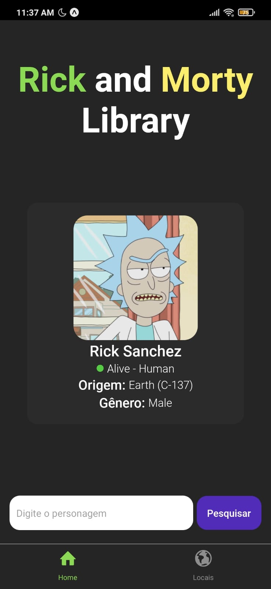

 <h1 align="center">Rick and Morty Library</h1>

 
App de biblioteca do Rick and Morty feito com React Native. Usando a API <a href="https://rickandmortyapi.com/">rickandmortyapi</a>

 

<h2 align="center">Instalando o projeto na sua máquina:</h2>

Comece clonando o repositório:

<pre><strong>$ git clone https://github.com/marlleyck/rick-and-morty-app</strong></pre>

Depois, vá até a pasta do repositório:

<pre><strong>$ cd rick-and-morty-app</strong></pre>

Após isso, instale as dependencias, usando o gerenciador de sua preferência:

<pre><strong>npm install</strong></pre>
<pre><strong>yarn</strong></pre>

E então, basta iniciar o servidor usando:

<pre><strong>expo start</strong></pre>
